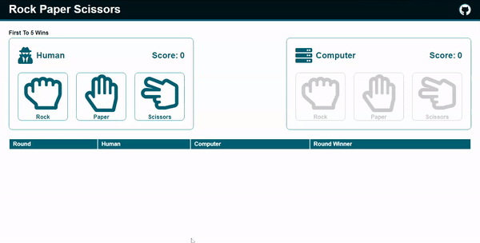
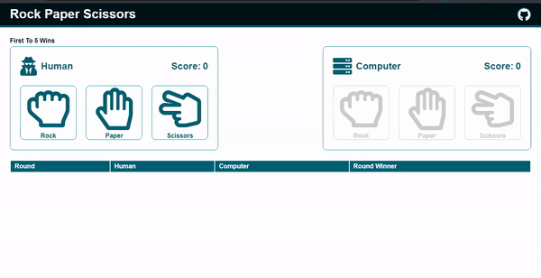

# Rock, Paper, Scissors.
- This project is created as part of submissions for The Odin Project

## Features
- Player and computer selections are animated to reflect selections per round.
- Results per round are displayed in a nicely formatted table with the most recent result at the top of table
- The table also uses icons to show player and computer selections per round
- Final game winner is displayed in a pop up box with a button to restart game.

## Demo Gifs

See Demo link here https://thecodingarchi.github.io/rock-paper-scissors/